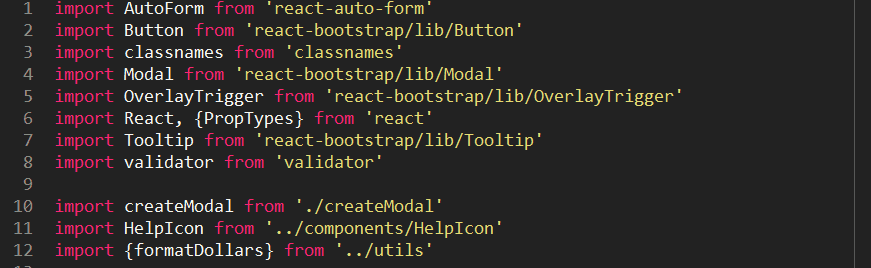

# Sort JavaScript Imports

Adds a Sort JavaScript Imports command to Sublime Text 2 or 3, which sorts selected lines containing JavaScript `import` statements or `require()` calls by the module path they're importing.

## Install via [Package Control](https://packagecontrol.io/) ([pending](https://github.com/wbond/package_control_channel/pull/5541))

`Ctrl-Shift-P`/`Command-Shift-P` → Package Control: Install Package → Sort JavaScript Imports

## Install via `git clone`

Preferences → Browse Packages… → `git clone https://github.com/insin/sublime-sort-javascript-imports.git "Sort JavaScript Imports"`

## Usage

Select lines containing the import statements you want to sort, then use either of:

- Command palette: `Ctrl-Shift-P`/`Command-Shift-P` → Sort JavaScript Imports
- Default key binding: `Alt-F9` on Linux/Windows or `Alt-F5` on Mac

Lines will be sorted based on the module path being imported, respecting (and normalising) any blank lines used to divide imports into different categories.

Any non-import lines in the selection will be moved to the end, separated by a new blank line if necessary. [Let me know](https://github.com/insin/sublime-sort-javascript-imports/issues/new) if there's a preferable way to handle these.

## Import ordering

Where top-level imports and path-based imports are mixed in the same block, they will be ordered as follows:

1. Top-level imports
2. Imports which traverse up out of the current directory, from furthest away to closest
3. Imports within the current directory

**Note:** if you're using Webpack aliases or a Babel alises plugin for top-level importing of your app's own code, you might want to put those in a separate block for clarity.

## Example

## MIT Licensed

Unit testing and configuration setup cribbed from [Sort Lines (Numerically)](https://github.com/alimony/sublime-sort-numerically).
